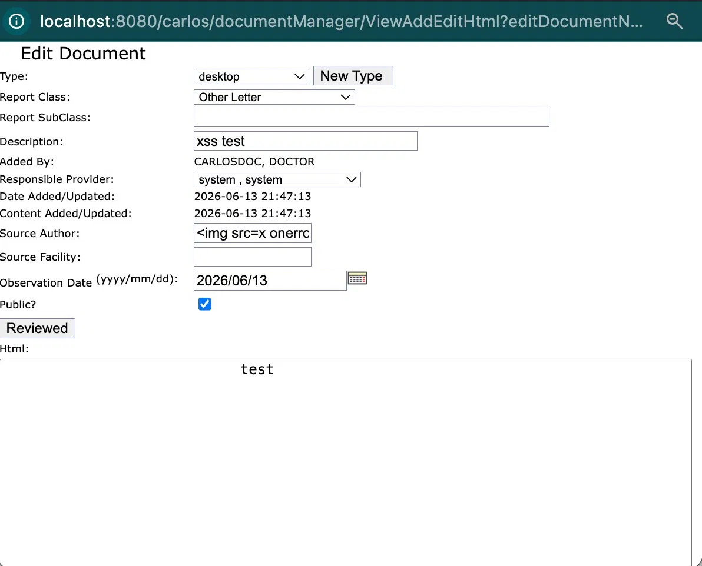
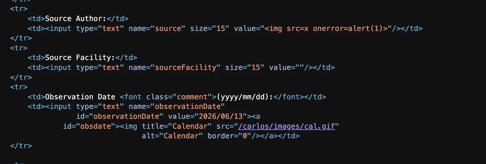
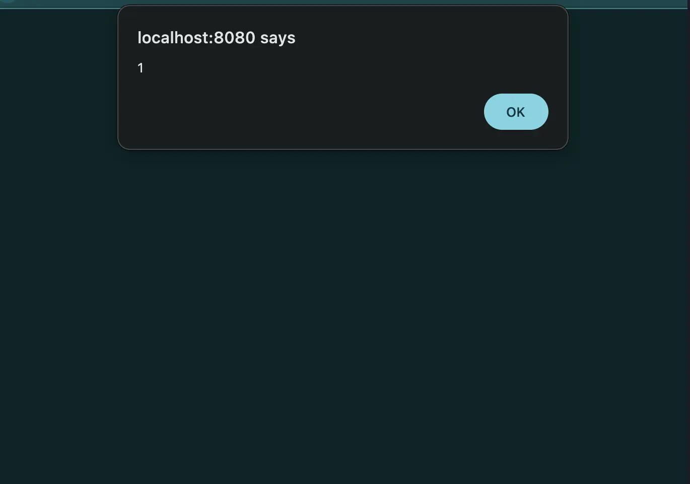

# Contribution 1: [Security] XSS — Multiple unencoded fields in documentManager/addedithtmldocument.jsp (claude assist)
 #2315

**Contribution Number:** 1  
**Student:** Kevin Cortez  
**Issue:** [[GitHub issue link]](https://github.com/carlos-emr/carlos/issues/2315)  
**Status:** Phase I Complete

---

## Why I Chose This Issue

I chose this issue because it sits at the intersection of web security and real-world software. These are two areas I genuinely care about. I have a solid cybersecurity foundation backed by hands-on projects, so XSS vulnerabilities are something I understand at a technical level, not just in theory. I wanted a contribution where my security background would actually matter, not just my ability to follow a tutorial.

The issue is also well-scoped for a first contribution: one file, five specific lines, a clear fix pattern using the **carlos:encode** taglib, and exact line numbers provided. I know what "done" looks like before I write a single line of code, which makes it a strong fit for a focused weekly cycle.

---

## Understanding the Issue

### Problem Description

**addedithtmldocument.jsp** renders database-sourced fields including free-text source fields and provider names directly into HTML attributes, HTML body, and a JavaScript array literal without any encoding. This allows stored XSS payloads to execute for any user who opens the document edit form.

### Expected Behavior

All user-supplied or database-sourced values rendered into HTML or JavaScript should be HTML-encoded using the **carlos:encode** taglib before output, preventing any injected markup or scripts from executing.

### Current Behavior

Five fields across the file output raw values with no encoding applied. A malicious value like **** stored in the source field would execute in the browser when the form loads.

### Affected Components

**src/main/webapp/WEB-INF/jsp/documentManager/addedithtmldocument.jsp**: lines 287, 373, 404, 408, and 428.

---

## Reproduction Process

### Environment Setup

Set up CARLOS EMR using Docker Desktop and docker-compose. The devcontainer build hung indefinitely on the Playwright browser installation step (step 15/37). 

Fixed by commenting out the Playwright install lines in `.devcontainer/development/Dockerfile` since Playwright is not needed for this fix. Used `docker-compose up -d --build` directly instead of the VS Code devcontainer flow. 

First `make install` was OOM killed, fixed it with `export MAVEN_OPTS="-Xmx1512m -Xms512m"` before running `make install`. Build completed successfully after that.

### Steps to Reproduce

1. Log into CARLOS at `http://localhost:8080/carlos` with username `carlosdoc`, password `carlos2026`, PIN `2026`
2. Click **eDoc** in the top navigation
3. Click **Add HTML**
4. Fill in all fields - Type: desktop, Report Class: Other Letter, Description: xss test, Responsible Provider: system system, Source Author: ``, Source Facility: test, Html: test, check Public
6. Click Submit
7. Click the edit icon on the saved document
8. Right click page, View Page Source, search for `img src=x`

**Expected:** `&lt;img src=x onerror=alert(1)&gt;` : HTML encoded
**Actual:** `value=""` : raw unencoded payload in HTML attribute

### Reproduction Evidence

- **Commit showing reproduction:** [[carlos/tree/2315-bug-addedithtmldocument-xss]](https://github.com/kpuentec/carlos/tree/2315-bug-addedithtmldocument-xss)
- **Screenshots/logs:**
  - 
  - 
  - 
- **My findings:** The `carlos` taglib is already declared and used on other fields in the same file but was not applied to these five specific fields.

---

## Solution Approach

### Analysis

Root cause is in `addedithtmldocument.jsp`. Five fields output raw database values without HTML encoding. The `carlos:encode` taglib is already imported at the top of the file and used on other fields, but it was simply not applied to these five.

### Proposed Solution

Wrap each of the five vulnerable fields with `<carlos:encode>` using the appropriate context. `htmlAttribute` for fields inside HTML attributes, `html` for fields in the HTML body, and `javaScriptBlock` for the JS subclass array.

### Implementation Plan

**Understand:** Five fields in `addedithtmldocument.jsp` render database values directly into HTML without encoding, allowing stored XSS for any provider who opens the document edit form.

**Match:** The `carlos:encode` taglib pattern is already used throughout this exact file on other fields. The fix follows the identical pattern already established in the codebase.

**Plan:**
1. Wrap `formdata.getSource()` on line 404 with `carlos:encode` in `htmlAttribute` context
2. Wrap `formdata.getSourceFacility()` on line 408 with `carlos:encode` in `htmlAttribute` context
3. Wrap `EDocUtil.getProviderName(formdata.getDocCreator())` on line 373 with `carlos:encode` in `html` context
4. Wrap `EDocUtil.getProviderName(formdata.getReviewerId())` on line 428 with `carlos:encode` in `html` context
5. Wrap `subClasses.get(i)` on line 287 with `carlos:encode` in `javaScriptBlock` context

**Implement:** https://github.com/kpuentec/carlos/tree/2315-bug-addedithtmldocument-xss

**Review:** Will verify all changes match existing `carlos:encode` patterns in the file, use DCO sign-off on all commits (`git commit -s`), and target the `develop` branch per CONTRIBUTING.md.

**Evaluate:** After fix, reload the edit form — page source should show `&lt;img src=x onerror=alert(1)&gt;` instead of the raw tag. Run `make install --run-unit-tests` to confirm no regressions.

---

## Testing Strategy

### Unit Tests

- [ ] Test case 1: [Description]
- [ ] Test case 2: [Description]
- [ ] Test case 3: [Description]

### Integration Tests

- [ ] Integration scenario 1
- [ ] Integration scenario 2

### Manual Testing

[What you tested manually and results]

---

## Implementation Notes

### Week [X] Progress

[What you built this week, challenges faced, decisions made]

### Week [Y] Progress

[Continue documenting as you work]

### Code Changes

- **Files modified:** [List]
- **Key commits:** [Links to important commits]
- **Approach decisions:** [Why you chose certain approaches]

---

## Pull Request

**PR Link:** [GitHub PR URL when submitted]

**PR Description:** [Draft or final PR description - much of the content above can be adapted]

**Maintainer Feedback:**
- [Date]: [Summary of feedback received]
- [Date]: [How you addressed it]

**Status:** [Awaiting review / Iterating / Approved / Merged]

---

## Learnings & Reflections

### Technical Skills Gained

[What you learned technically]

### Challenges Overcome

[What was hard and how you solved it]

### What I'd Do Differently Next Time

[Reflection on your process]

---

## Resources Used

- [Link to helpful documentation]
- [Tutorial or Stack Overflow post that helped]
- [GitHub issues or discussions that helped]
